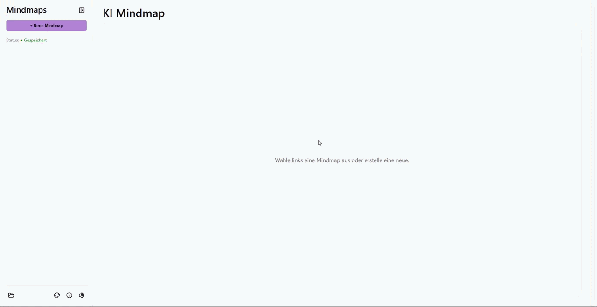

# KI Mindmap

## [im Browser öffnen →](https://ki-mindmap.vercel.app/)

  

 

## Funktionen

* **KI-Erweiterung:** Erweitere die Mindmap mit Hilfe von Google Gemini.
* **lokales Speichern:** Die Mindmaps werden lokal auf der Festplatte gespeichert. Kein Cloud-Speicher.
* **Akzentfarbe ändern:** Passe die Akzentfarbe nach Deiner Vorliebe frei an.
* **Anordnung am Raster:** Die Knoten richten sich am Raster aus und passen ihre Größe daran an.
  
  ---

## Feedback

[Fehler melden](https://github.com/jannis-buesing/KI-Mindmap/issues) - [Feature vorschlagen](https://github.com/jannis-buesing/KI-Mindmap/issues)

